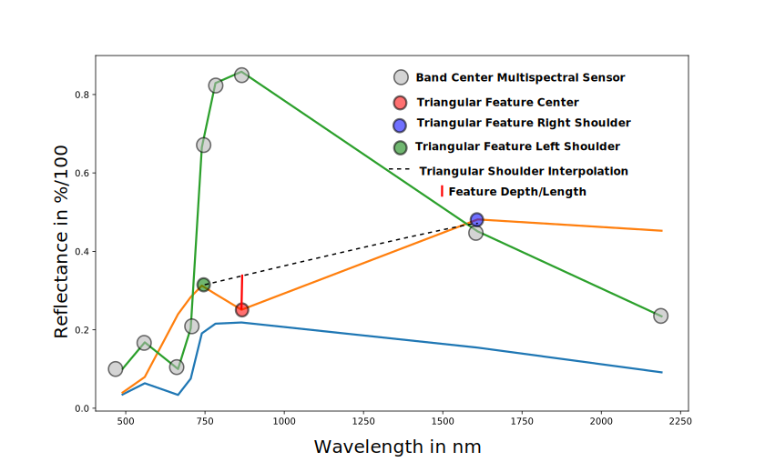
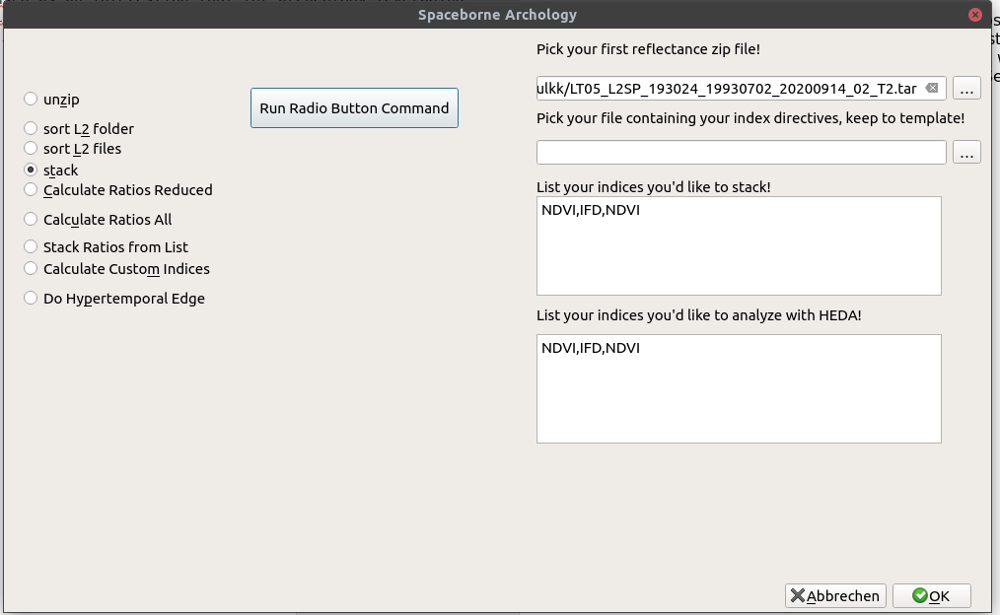

DAINST Spaceborne Archeology QGIS Tool Description
==========================================

Introduction
------------
Here we describe the tool for the calculation of useful ratios and indices from NASAs Landsat fleet and ESAs Copernicus Sentinel2 fleet, which can be used as an interesting tool for archeology leveraging  the multitemporal nature of the data and its wide area swath width combined with a long time series of more than 35 years in case of Landsat and more than 5 years in case of the Copernicus Sentinel2 fleet. Several studies, have sparked the interest of using remote sensing data in the framework of the Copernicus for cultural heritage preservation. A first national agenda setting for the wide usage of copernicus data for cultural heritage has been done at the german national Copernicus users workshop in 2021 with a [user session](https://www.d-copernicus.de/infothek/veranstaltungen/nationales-forum-2021/programm/f1-copernicus-fuer-kulturgueterschutz-und-archaeologie/) which has been led by Dr. Benjamin Ducke. This activity led to the development of the here presented first version of the DAINST Spaceborne Archeology tool, which has been designed to work with multispectral data from the wide swath missions of ESA (Copernicus Sentinel-2) and NASAs Landsat Fleet. 

Data Format and Retrieval
-------------------------

The users are strongly encouraged to use the [USGS Earth Explorer](https://earthexplorer.usgs.gov/) for the Landsat Level-2 reflectance data labeled with: **L2SP** and the [OPEN HUB](https://scihub.copernicus.eu/dhus/#/home) of ESA for retrieving Level-2 Reflectance data Products of Sentinel-2 labeled with: **MSIL2[A/B/C]**. All the data files should be downloaded to the same data directory for the project. Please note that Landsat has a distinct [PATH/ROW](https://landsat.gsfc.nasa.gov/about/the-worldwide-reference-system/) identifier, whilst [Sentinel-2 data products](https://sentinel.esa.int/web/sentinel/missions/sentinel-2/data-products) are offered in a 100x100km tile grid. Whilst Landsats full swath data always delivers similar covered regions Sentinel data may be clipped at the swath edges according to the sensors orbit/viewing geometry. This results in sometimes full data coverage over the 100x100km tile or only partial coverage and black cut edges according to the aforementioned parameters.

Spectral Data
-------------

After stacking has been performed (more on how to do that later...), spectral data may be viewed with e.g. the [EnMAP Toolbox](https://enmap-box.readthedocs.io/en/latest/). Each data point of your stacked  image contains a spectrum of in case of Copernicus Sentinel-2 data (see the figure below) 9 discontinuos spectral measurements in the solar reflective wavelength domain [350-2500nm]. The material properties determine the "spectral fingerprint" of the material. In the figure below green for green vegetation, orange for hematite (an iron-bearing oxide mineral) and fresh oak leaves in blue. These spectra were extracted from the USGS Digital Spectral Library-7[1]. Users are encouraged to visit the website of the [USGS Spectroscopy Lab] (https://www.usgs.gov/labs/spectroscopy-lab) should they wish to learn more on spectral imaging. For a full in-depth MOOC course on spectral imaging please visit the [HyperEdu](https://eo-college.org/courses/beyond-the-visible/) page.
For our purposes multispectral data recorded at non-continous spectral wavelengths shall be sufficent to uncover subtle material details and changes thereof over time. 

The spaceborne archeology tool offers the calculation of either pre-defined spectral ratios for a reduced (GUI option: Ratios Reduced) or full parameter set (GUI option: Ratios all). Users may also define their own three-point band depth ratios, as illustrated in the spectral figure for the orange hematite spectrum, via a comma-seperated-value (.csv) file. The first line of the file should carry the center wavelength (red dot in the spectral plot figure), the second line should carry the right shoulder of the defined feature (blue dot in the spectral plot figure. The third line should contain (green dot in the spectral plot figure). It is absolutely mandatory that the left shoulder refers to the lowest wavelength in your feature whilst the highest wavelength always refers to the highest wavelength in your feature. The center wavelength should always be between both shoulder points.
Please define features matching the center wavelengths of e.g. Landsat-8 (443, 482, 562, 655, 865, 1610, 2200) or 20m Sentinel-2 (490, 560, 665, 705, 740, 783, 865, 1610, 2190). You may checkout the correct wavelength parameters by directly open up a stacked dataset header suffixed '.hdr' (e.g. L2A_T33UUU_A026117_20220307T102247_20m_stack_file.hdr) with a text editor of your choice. 

